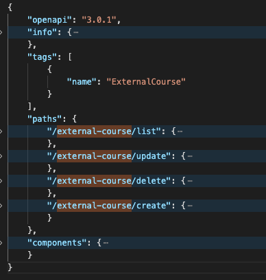
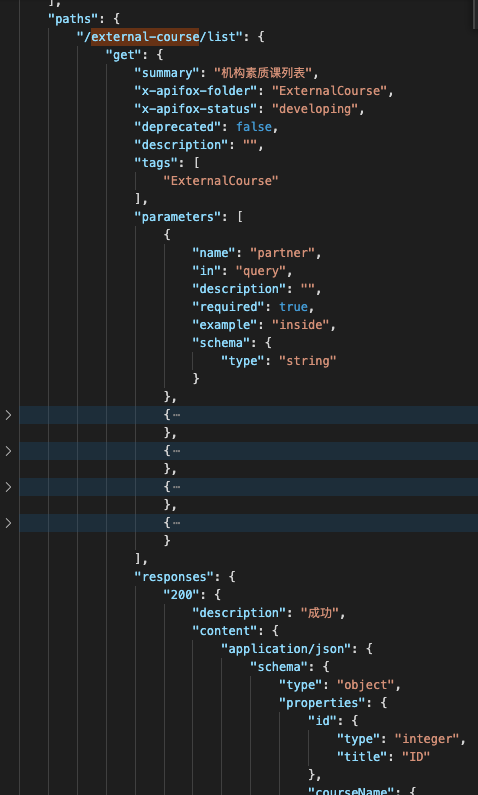
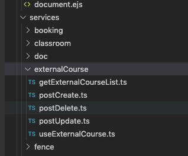
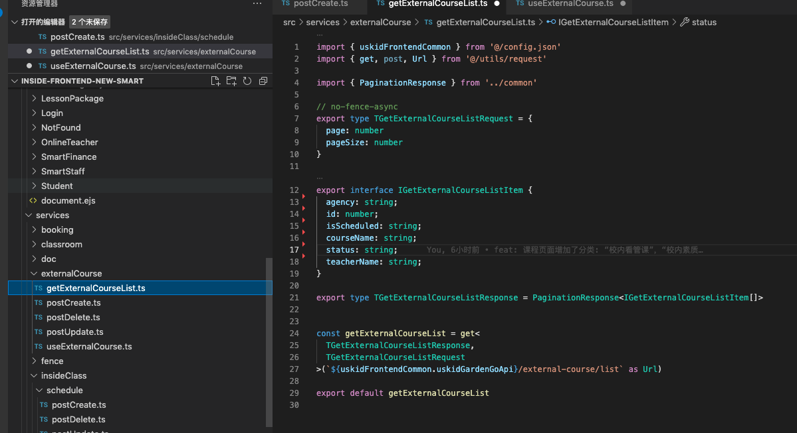
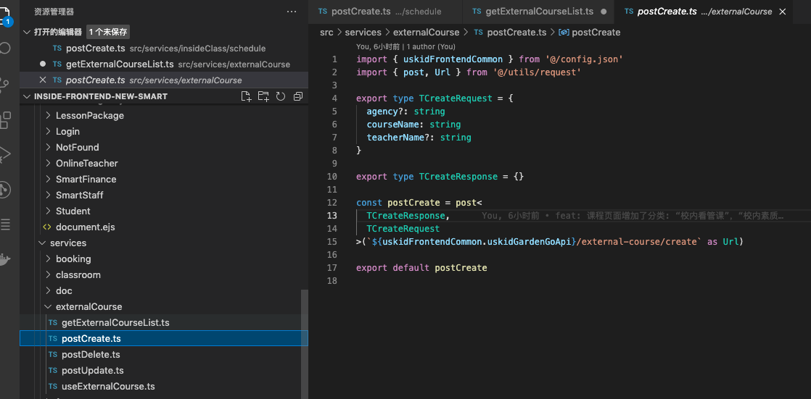
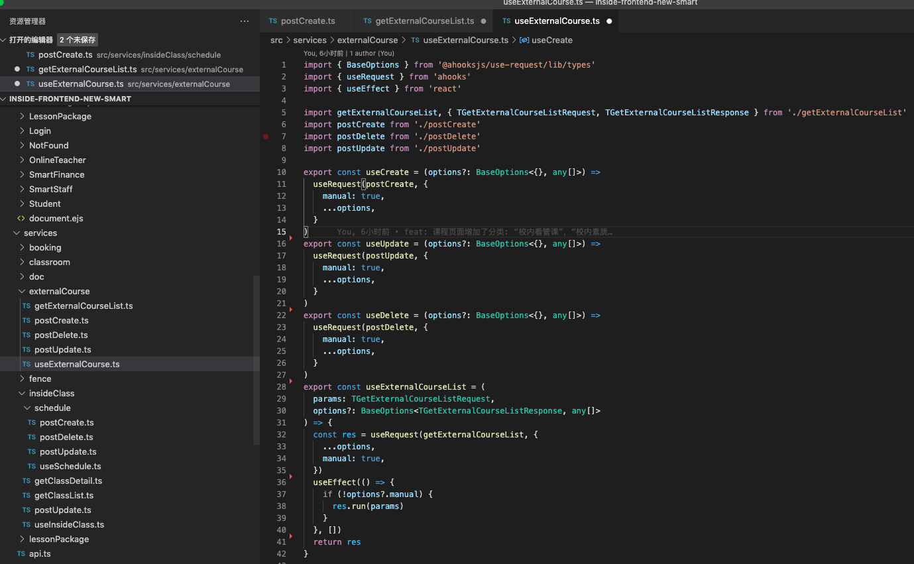

# openapi-ts-codegen

Codegen

### 理想效果：
##### 根据apifox导出的的OpenAPI格式(swager3.0)的数据地址生成对应的api接口文件

##### 根据生成的文件地址请求接口返回对应的数据，格式如下：
   
   
   

##### 想要生成的文件如下显示：   
   
   
   
   

### 设计思路：
	1.将openapi文件导入项目data中
	2.根据输入的项目名称生成一个根文件夹
	3.遍历data中的paths，正则匹配路径，最后一个/之后的为文件名称，之前的是文件夹的名称
	4.通过path`mkdir -p`命令生成文件，通过`touch ${fileUrl}.ts`生成文件
	5.判断paths下的使用的时get或post方法向文件中添加不同的内容(方法：`echo ${createFileContent} >> ${fileUrl}.ts`)
	6.递归schema生成接口类型，添加到文件中
	7.生产的文件通过npx prettier --write 格式化文件

### 依赖库：
    1.ts-node  
    2.zx
	3.prettier  

### 使用流程：
	1.npm install
	2.将apifox导出的文件地址，复制到项目的data.ts文件中
	3.运行脚本npm run create-api
	4.输入项目名称，生成根文件夹
