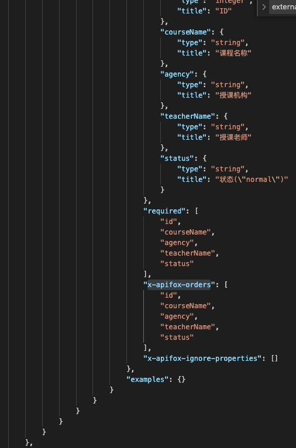

# openapi-ts-codegen

Codegen

### 理想效果：
##### 根据apifox导出的的OpenAPI格式(swager3.0)的数据地址生成对应的api接口文件

##### 根据生成的文件地址请求接口返回对应的数据，格式如下：
   
   
   

##### 想要生成的文件如下显示：   
   
   
   
   

### 设计思路：
	1.生成一个api数组文件，可以遍历所有的api地址，请求数据
	2.根据输入的项目名称生成一个根文件夹
	3.遍历每个api生成数据中的paths，正则匹配路径，最后一个/之后的为文件名称，之前的是文件夹的名称。每个文件生成的同时生成对应的useService文件
	4.useService文件中引入同一路径下的接口文件，并使用useRequest方法包裹，向外抛出

### 依赖库：
    1.ts-node  
    2.zx  

### 使用流程：
	1.将apifox导出的文件地址，复制到项目的api文件中
	2.运行脚本npm run create-api
	3.输入项目名称，生成根文件夹
